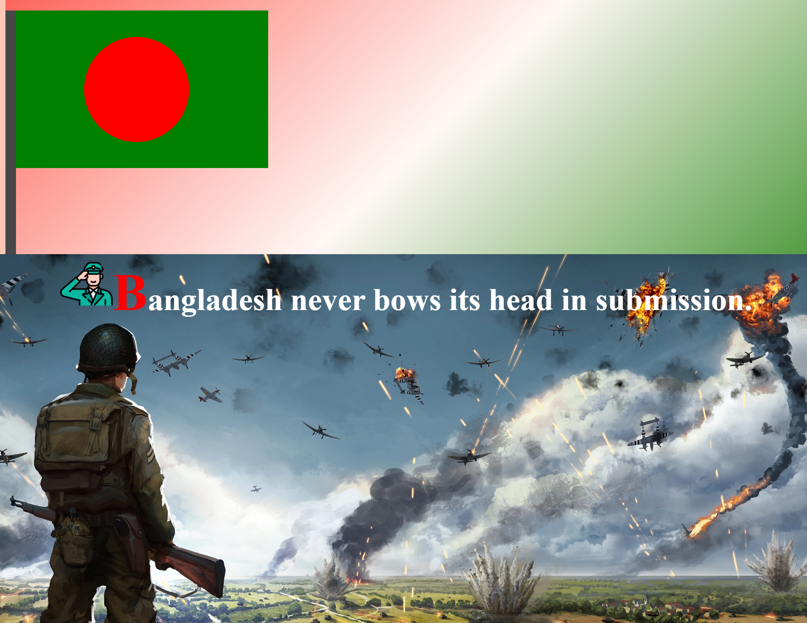

# css-background

# Bangladesh Flag Project

## Project Overview

This project demonstrates a beautifully designed representation of **Bangladesh's national pride** using HTML and CSS. The layout showcases the country's iconic **flag** along with a meaningful quote reflecting Bangladesh's resilient spirit.

## Features

- **Flag Representation**:
  - A green square with a centered red circle resembling the Bangladesh flag.
- **Stand and Pole**:
  - A stylized representation of the flag's pole and stand for realism.
- **Inspirational Heading**:
  - A bold statement emphasizing Bangladesh's determination: _"Bangladesh never bows its head in submission."_
- **Logo**:
  - Includes a symbolic image (`honour.png`) to enhance the design.

## Technologies Used

- **HTML5**: For the structure of the page.
- **CSS3**: For styling the flag, pole, stand, and other elements.

## Author

**Asif Iqbal**  
Beginner Full Stack Web Developer  
Passionate about crafting visually appealing and meaningful web projects.
